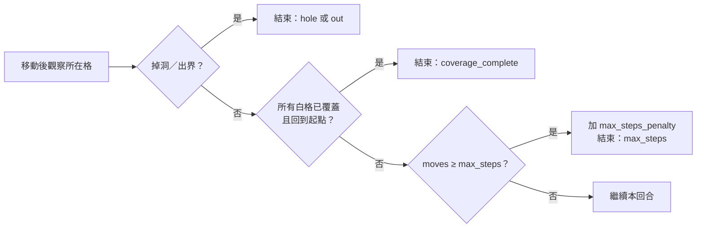

# Q-Learning 與 SARSA 程式流程圖

兩種演算法共用地圖、玩家、獎勵、移動限制與回合終止邏輯；差異在於 Q 值更新時使用的下一步價值。

## Q-Learning

```mermaid
flowchart TD
    A([開始／新回合]) --> B[從 Player 取得 state<br/>row, col, visited_white_mask]
    B --> C[取得不出界、不進洞、<br/>不斜穿洞的合法動作]
    C --> D{epsilon 探索？}
    D -- 是 --> E[隨機選擇合法動作]
    D -- 否 --> F{softmax 策略？}
    F -- 是 --> G[依 Q 值 softmax 抽樣]
    F -- 否 --> H[選合法動作中最大的 Q 值]
    E --> I[Player.step 執行動作]
    G --> I
    H --> I
    I --> J{成功移動？}
    J -- 否 --> K[reward = blocked_penalty<br/>next_state = state]
    J -- 是 --> L[Player.observe_tile<br/>取得基礎 reward、done、event]
    L --> M[加入未覆蓋白格／回起點 shaping]
    M --> N[檢查 moves 是否達 max_steps]
    K --> O{done？}
    N --> O
    O -- 是 --> P[target = reward]
    O -- 否 --> Q[在 next_state 的合法動作中<br/>取 max Q]
    Q --> R[target = reward + gamma × max Q]
    P --> S[以自適應 alpha 更新 Q(state, action)]
    R --> S
    S --> T{回合結束？}
    T -- 否 --> B
    T -- 是 --> U[記錄回合結果、epsilon 衰減、<br/>Player 回到起點]
    U --> V([下一回合])
```

Q-Learning 使用 off-policy target：即使下一步實際探索到其他動作，更新時仍使用 `next_state` 所有合法動作中的最大 Q 值。

## SARSA

```mermaid
flowchart TD
    A([開始／新回合]) --> B[從 Player 取得 state<br/>row, col, visited_white_mask]
    B --> C{存在同一 state 的<br/>pending_action？}
    C -- 是 --> D[沿用上一步為 SARSA target<br/>抽出的 action]
    C -- 否 --> E[依 epsilon + softmax／greedy<br/>選擇合法 action]
    D --> F[清除 pending state/action]
    E --> F
    F --> G[Player.step 執行 action]
    G --> H{成功移動？}
    H -- 否 --> I[reward = blocked_penalty<br/>next_state = state]
    H -- 是 --> J[Player.observe_tile<br/>取得基礎 reward、done、event]
    J --> K[加入未覆蓋白格／回起點 shaping]
    K --> L[檢查 moves 是否達 max_steps]
    I --> M{done？}
    L --> M
    M -- 是 --> N[target = reward]
    M -- 否 --> O[依同一行為策略選出<br/>next_action]
    O --> P[target = reward + gamma × Q(next_state, next_action)]
    N --> Q[以自適應 alpha 更新 Q(state, action)]
    P --> Q
    Q --> R{回合結束？}
    R -- 否 --> S[保存 next_state + next_action<br/>供下一步實際執行]
    S --> B
    R -- 是 --> T[記錄回合結果、epsilon 衰減、<br/>Player 回到起點]
    T --> U([下一回合])
```

SARSA 使用 on-policy target：更新中的 `next_action` 會被保存，並在下一個訓練步驟真正執行。

## 共同的回合完成條件



完整覆蓋結果會以 `moves`（成功移動次數）排序；最少 `moves` 的成功回合即為目前記錄的最短路線。
